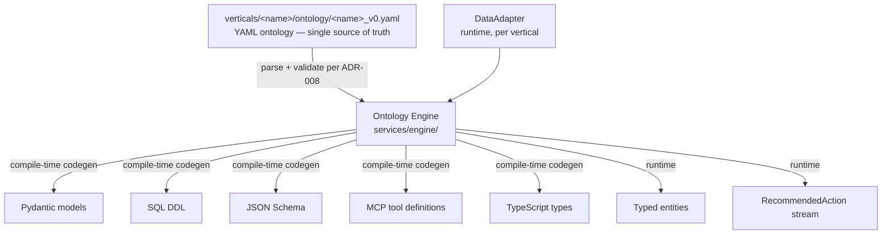
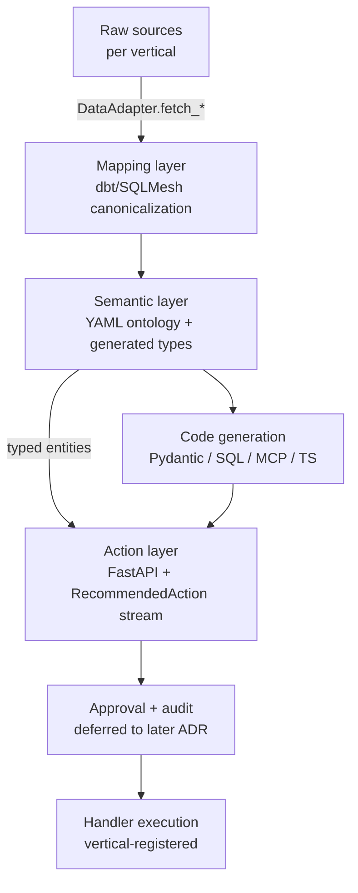

# ADR-007: Operational Control Tower (OCT) Engine Contracts

**Status:** Accepted
**Date:** 2026-05-13
**Deciders:** Jirachai Thiemsert (founder)
**Related:** ADR-005 (strategic pivot), ADR-006 (vertical plugin architecture), ADR-008 (YAML ontology spec, paired), CLAUDE.md §3

## Context

ADR-006 §"5 architectural patterns" identifies that the engine owns:
- Ontology = single source of truth (YAML)
- Data Adapter = pluggable interface (Protocol per vertical)
- Action Framework = generic envelope (RecommendedAction)
- Demo Data Generator = per-vertical (engine defines contract only)
- Pitch Narrative = co-located (out of scope for this ADR)

This ADR specifies the **concrete contracts** for #2 and #3, plus the
**three-layer wiring** that connects them. **Out of scope:** LLM
reasoning hook surface, action approval workflow, audit trail framework
— each warrants its own ADR (deferred).

## Decision

### D1: DataAdapter Protocol (async-first)

```python
from typing import Protocol, runtime_checkable
from datetime import datetime

@runtime_checkable
class DataAdapter(Protocol):
    """Per-vertical data ingress contract.

    Implementations live in `verticals/<name>/data_adapter/`.
    Engine never instantiates DataAdapter directly — verticals register
    their implementation via plugin discovery.
    """

    vertical_name: str
    """Stable identifier matching `verticals/<name>/` directory."""

    async def fetch_objects(
        self,
        object_type: str,
        filter_expr: str | None = None,
        limit: int = 1000,
    ) -> list[dict]:
        """Return raw object dicts; engine maps to typed entities via ontology."""
        ...

    async def fetch_links(
        self,
        link_type: str,
        from_pk: str | None = None,
        to_pk: str | None = None,
    ) -> list[dict]:
        """Return raw link dicts (from_pk, to_pk, metadata)."""
        ...

    async def stream_events(
        self,
        event_type: str,
        since: datetime | None = None,
    ):
        """Async iterator over OperationalEvent-shaped dicts. Implementations
        may poll or subscribe; engine treats both uniformly."""
        ...

    async def health_check(self) -> dict:
        """Return adapter status; engine surfaces in operational map."""
        ...
```

**Why async-first:**
- FastAPI (per CLAUDE.md §3) is async-native; sync adapters block event loop
- I/O-bound operations (network, DB) benefit from async concurrency
- Sync needs can wrap async via `asyncio.run()` at call site if necessary

### D2: RecommendedAction envelope (production-grade)

```python
from pydantic import BaseModel, Field
from datetime import datetime
from typing import Any

class ReasoningStep(BaseModel):
    step_id: str
    kind: str = Field(..., description="e.g., 'ontology_query', 'llm_inference', 'rule_check'")
    summary: str
    detail: dict[str, Any] | None = None

class EntityRef(BaseModel):
    object_type: str
    primary_key: str
    title: str | None = None

class AuditMetadata(BaseModel):
    """Initial scope; expanded in future audit-framework ADR."""
    actor: str
    actor_kind: str = Field(..., description="'engine', 'llm', 'human'")
    correlation_id: str | None = None
    notes: str | None = None

class RecommendedAction(BaseModel):
    """Generic envelope; vertical-specific handler interpretation lives
    in registered handlers, NOT in this schema."""

    id: str
    title: str
    description: str
    vertical: str = Field(..., description="Originating vertical name")
    reasoning_trace: list[ReasoningStep]
    confidence: float = Field(..., ge=0.0, le=1.0)
    affected_entities: list[EntityRef]
    suggested_handler: str = Field(..., description="Registered handler name")
    handler_payload: dict[str, Any] = Field(default_factory=dict)
    requires_approval: bool = True
    approval_chain: list[str] = Field(default_factory=list, description="Role names")
    audit_metadata: AuditMetadata
    created_at: datetime
    expires_at: datetime | None = None
```

**Why production-grade (not minimal):** ADR sets target contract;
PLAN-003 (Batch 4) implements subset first. Defining full envelope
upfront avoids renumbering ADR when fields get added.

### D3: Ontology engine I/O boundary



### D4: Three-layer wiring



**Layer ownership:**

| Layer | Owned by | Examples |
|-------|----------|----------|
| Raw → canonical | Vertical (data_adapter/) | Regional grid API → asset records |
| Canonical → typed | Engine (semantic layer) | Pydantic class instantiation |
| Typed → action | Engine (action layer) + handlers (vertical) | LLM reasoning → RecommendedAction |
| Approval + audit | Future ADR | (placeholder) |

## Consequences

### Positive
- Engine + verticals separable; verticals N+1 add without engine changes
  (per ADR-006 promise)
- Async-first matches FastAPI; performance ceiling raised early
- RecommendedAction production-grade envelope means schema-stable across
  Batch 4 (PLAN-003) and Batch 5+ (vertical implementations)
- Three-layer diagram makes engine boundary explicit for code review

### Negative
- Async-first adds learning curve if any vertical wants sync-only
  adapter (workaround: wrap with `asyncio.run`)
- RecommendedAction envelope is large; minimal MVP would have shipped
  faster (mitigated by PLAN-003 implementing subset progressively)
- LLM hook + audit deferred = ADR-007 doesn't fully specify action
  approval semantics (acknowledged; future ADR scope)

### Neutral
- ADR-008 codifies YAML ontology specifics; ADR-007 stays vertical-agnostic
- ADRs 001–006 unaffected; this ADR extends ADR-006 §5 patterns 2+3

## Alternatives Considered

### Alternative 1: Sync DataAdapter

- **Pros:** Simpler for solo dev; matches local-LLM sync inference
- **Cons:** Blocks FastAPI event loop; harder to retrofit async later
  than to retrofit sync from async
- **Why rejected:** Async-first is forward-compatible; sync wrappers
  are 1-line workarounds at call site

### Alternative 2: Minimal RecommendedAction envelope (5 fields)

- **Pros:** Faster MVP
- **Cons:** Schema breaks within 1–2 ADRs as production needs surface;
  ADRs aren't meant for frequent renumbering
- **Why rejected:** ADR specifies target contract; PLAN-003 chooses
  implementation subset

### Alternative 3: Include LLM reasoning hook + audit in this ADR

- **Pros:** Self-contained engine-contract ADR
- **Cons:** Mixes abstraction levels (mechanical I/O vs reasoning
  policy vs governance); harder to revise atomically
- **Why rejected:** Separation of concerns is worth the additional
  future ADR

### Alternative 4: Skip envelope schema; treat RecommendedAction as opaque dict

- **Pros:** Maximum flexibility
- **Cons:** Loses type safety; verticals diverge; UI/frontend can't
  rely on stable shape
- **Why rejected:** Type safety is a core vero-lite value (CLAUDE.md §8)

## References

- ADR-005 (strategic pivot to OCT)
- ADR-006 (vertical plugin architecture, §5 patterns 2 + 3)
- ADR-008 (YAML ontology specification, paired with this ADR)
- CLAUDE.md §3 (three-layer architecture mental model)
- `docs/conventions/diagram-syntax.md` (Mermaid used per convention
  for repo artifacts, codified in this batch)
- Palantir Foundry ontology research notes (Cowork-produced,
  gitignored working reference; consult if Cowork dispatch
  `2026-05-13-1400-cowork-research-prompt-palantir-ontology.md`
  completed): `docs/research/private/2026-05-13-palantir-ontology-reference.md`
- Future: ADR-010+ (LLM reasoning hook surface) *— note: ADR-009 slot
  consumed by tier-topology change per ADR-009; downstream future-ADR
  slots shifted accordingly*
- Future: ADR-011+ (Action approval + audit framework)
