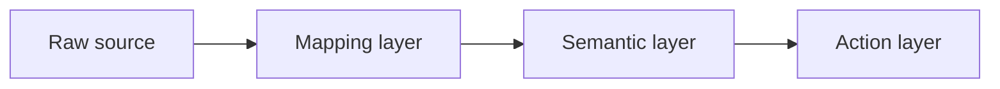

# Diagram Syntax Convention

**Status:** Accepted
**Date:** 2026-05-13 (Session 10 Batch 3)
**Source:** Code tab operational feedback 2026-05-13 (4-dimension
analysis: editing efficiency, validation, token economy, review surface)
**Related:** ADR-007 (first vero-lite ADR using Mermaid per this
convention), CLAUDE.md §10

## Rule

| Context | Use |
|---------|-----|
| ADRs, lessons, runbooks, any doc in `docs/` that lives in repo | **Mermaid** |
| `README.md` files (repo root + subdirectories) | **Mermaid** |
| Code comments (inline `#` or `//`) | ASCII art |
| Commit messages | ASCII art (Mermaid won't render in `git log`) |
| Terminal output / CLI help text | ASCII art |
| `.claude/handoffs/*.md` (gitignored, may be read in terminal) | ASCII art OK; Mermaid OK if intended for Project Knowledge upload |
| Quick sketches in Chat conversations | ASCII OK (throwaway) |

**Default for new repo artifacts: Mermaid.** Override to ASCII only
when (a) the context doesn't render Mermaid (terminal, commit log) or
(b) the diagram requires precise spatial layout that Mermaid can't
express.

## When ASCII is justified inside repo docs

Mermaid is the default for repo artifacts, but ASCII is the right
choice when the diagram requires **precise spatial layout** that
Mermaid auto-layout can't preserve. Examples:

- **Hardware rack diagrams** — physical positions matter (1U / 2U
  slots, port pinouts)
- **UI mockups** — relative widths, column alignment, button positions
- **Swim-lane diagrams with proportional widths** — when the visual
  width of each lane carries semantic meaning (e.g., time allocation)
- **Memory layout / bit field diagrams** — byte boundaries, bit
  positions are spatial

Flow charts, sequence diagrams, ER diagrams, state diagrams, class
hierarchy, dependency graphs, and decision trees do NOT require
precise spatial layout — they should be Mermaid.

## Rationale

### Editing efficiency

- **Mermaid:** localized edits. Adding a node or edge = adding 1 line.
  Claude's `Edit` tool produces clean diffs.
- **ASCII art:** small edits often break alignment of the whole block
  (box borders, arrows, padding). Often requires rewriting the entire
  diagram via `Write`. Token-expensive and review-noisy.

### Validation / correctness

- **Mermaid:** Claude can parse the grammar in-head. Syntax errors
  are catchable from text alone.
- **ASCII art:** correctness depends on visual alignment, which Claude
  cannot render. Misaligned boxes look "correct" character-by-character
  but render visually broken. No way to verify from text alone.

### Token economy

- **Mermaid** is significantly more compact than ASCII for diagrams
  with >5 nodes. ASCII inflates with whitespace + border characters.
- For small diagrams (<5 nodes), token cost is comparable; pick by
  rendering context.

### Review surface

- **Mermaid** renders natively on GitHub (PR diffs, file views, blob
  rendering). Reviewers see the diagram without leaving the browser.
- **ASCII** is readable in any context (terminal, commit log, code
  comment, copy-pasted in chat). No render step needed.

## Mermaid types vero-lite expects to use

Listed here for searchability; any Mermaid syntax documented at
https://mermaid.js.org/ is acceptable.

- `flowchart` (LR / TD) — engine wiring, layer relationships,
  decision flows. ADR-007 D4 uses this.
- `sequenceDiagram` — request/response flows, async event ordering,
  handoff timing
- `classDiagram` — object type hierarchies, Protocol relationships
- `erDiagram` — ontology entity relationships (Asset → Site →
  OperationalEvent, etc.)
- `stateDiagram-v2` — RecommendedAction lifecycle, approval state
  machines
- `gantt` — phase/batch timelines (rarely; STATUS.md may use this)

## Examples

### Good: Mermaid for an ADR

````markdown

````

Single line per node and edge. Adding a node = 1 line. Diff-clean.

### Good: ASCII for a README quick reference

```
Tier 0 → Cowork  (research, file output)
Tier 1 → Chat    (strategy, ADR drafting)
Tier 2 → Code    (repo, git, execution)
Tier 3 → Cray    (final authority)
```

Simple, readable in any context, no render dependency.

### Bad: ASCII flow chart in an ADR

```
+--------+      +--------+      +--------+
| Source | ---> | Engine | ---> | Action |
+--------+      +--------+      +--------+
```

Adding a 4th step or a side branch breaks the alignment of every
preceding line. Mermaid would handle this trivially.

### Bad: Mermaid in a commit message

A Mermaid fenced block in a commit subject/body — `git log` doesn't
render Mermaid. Reviewer sees raw text and frowns. Use ASCII art
instead, or skip the diagram and link to the rendered file in the
repo.

## References

- Code tab feedback 2026-05-13 (rationale source):
  `.claude/handoffs/session-10/2026-05-13-1400-chat-session10-batch3-kickoff.md`
  §"Stop-and-ask trigger #3"
- ADR-007 (first repo artifact using Mermaid per this convention):
  `docs/adr/0007-oct-engine-contracts.md`
- Mermaid documentation: https://mermaid.js.org/
- CLAUDE.md §10 (file index — this convention indexed there)
